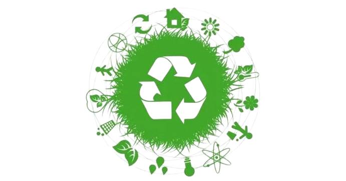

  

<h1 align="center"> Amigo da Vizinhança </h1>

O projeto **Amigo da Vizinhança** é uma iniciativa que busca melhorar a coleta seletiva de lixo e promover a conscientização ambiental por meio de um site desenvolvido com HTML, CSS e JavaScript. A plataforma orienta os moradores sobre o descarte correto de resíduos, informa horários e locais de coleta, e oferece fóruns por bairro para que a comunidade possa relatar problemas, fazer denúncias e discutir soluções para o descarte irregular de lixo.

## 🚀 Funcionalidades

- Site responsivo e fácil de usar;
- Fórum por bairro para comunicação entre moradores;
- Dicas sobre reciclagem e descarte adequado de resíduos;
- Informações úteis sobre coleta urbana.

---

## 📈 Impacto Esperado

A proposta busca tornar a cidade mais limpa, ecológica e tecnológica, com potencial para ser replicada em outras localidades e evoluir com novas funcionalidades.

---
**Desenvolvido como parte da AEP 4º Semestre - UniCesumar.**
